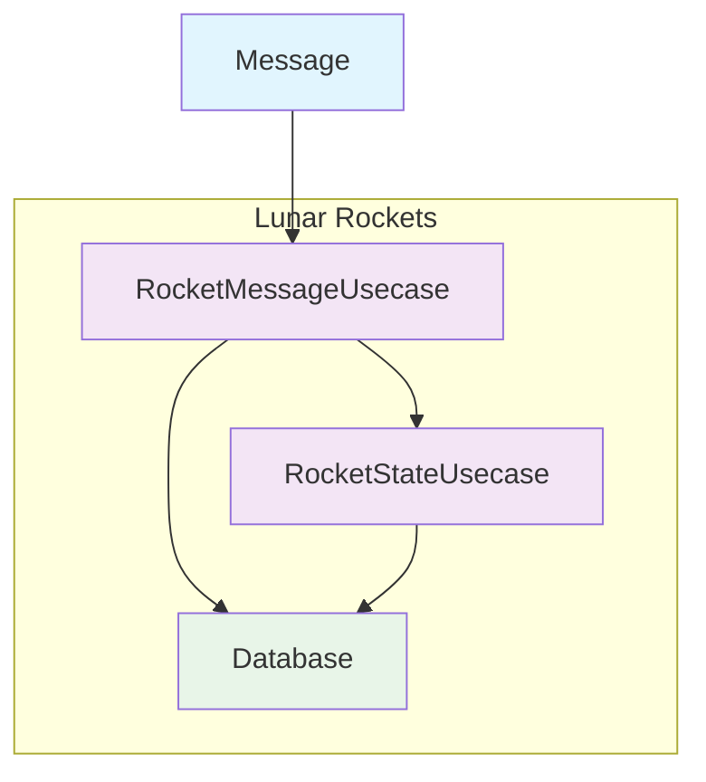
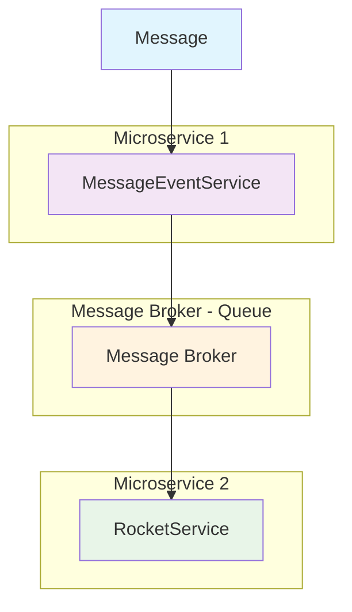

# Rocket Service Solution Architecture

## Overview

This service is a proposal of a very simple solution to the problem, based on the initial premise of receiving a maximum of **120 messages per minute**.

As an **MVP**, it would allow testing the product, which can then scale according to client/user needs and the system's own evolution.

## Components Involved

### Component Breakdown

| Component | Responsibility |
|-----------|----------------|
| **RocketMessageUsecase** | Handle deduplication/order messages (In-memory buffer) |
| **RocketStateUsecase** | Handle the state of rockets (SQLite) |
| **RocketUseCase** | Retrieve rockets information (SQLite) |

## Current Solution

This solution is based on a **single service in Golang** that allows maintaining the state of a rocket, handling deduplication and ordering of rocket messages, which is an important premise to consider in the implementation.

### Current Limitations

However, this approach carries many limitations:

- **Message Ordering**: Uses in-memory storage, which is not fault-tolerant
- **Database**: Uses SQLite for message persistence and rocket state - a lightweight database that doesn't scale
- **Error Handling**: No retry mechanisms in case a rocket state change fails
- **Architecture**: The way the service is built is not scalable
- **Testing**: While the code uses clean architecture and dependency injection for business layer testing, it requires additional integration tests for:
  - Repository layer
  - HTTP layer
  - End-to-End message flow
  - Performance tests

## Scaling Solution

If the system scales to **5000 messages per minute**, we should move to a more robust solution like an **event-driven architecture**:

### Enhanced Architecture Considerations

#### Application Layer
- **Fault Tolerance**: System resilience and graceful degradation
- **Retry Mechanisms**: Managing and recovering from errors

#### Data Layer
- **Crash Recovery**: Ensuring database consistency after crashes
- **Scalable Databases**: Use databases that support scaling strategies

#### Observability & Monitoring
- **Distributed Tracing**: Track requests across services
- **Metrics & Logging**: Structured logging for better debugging
- **Monitoring Tools**: Export data to proper tools for observability and monitoring

---

## Summary

The current MVP solution provides a simple starting point for testing and validation, but scaling beyond 120 messages per minute requires a fundamental architectural shift to an event-driven approach with proper fault tolerance, scalable databases, and comprehensive observability.